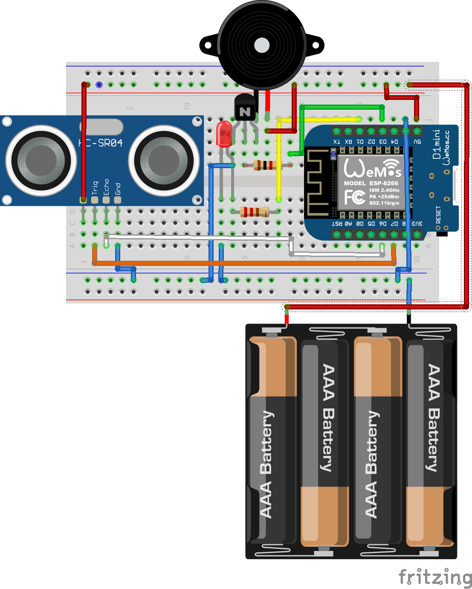

# Distance measurement

This tiny project I made with my daugther. When she came to me asking for a little handheld which is peeping and blinking I thought using a ultra sonic sensor could be fun.
So I sit down an draw the layout:

in Fitzing.
The next day we put together the components and I loaded the first test sketch on the Wemos D1 mini. I have to commit that I didn´t test it before.

## Ultrasonic test sketch
You can find it [here](http://domain.de).

## LED blinking test sketch
You can find it [here](http://domain.de).

## Buzzer peeping test sketch
You can find it [here](http://domain.de).

When all components worked as they should we put the code snippets together

## Final code
You can find it [here](http://domain.de).