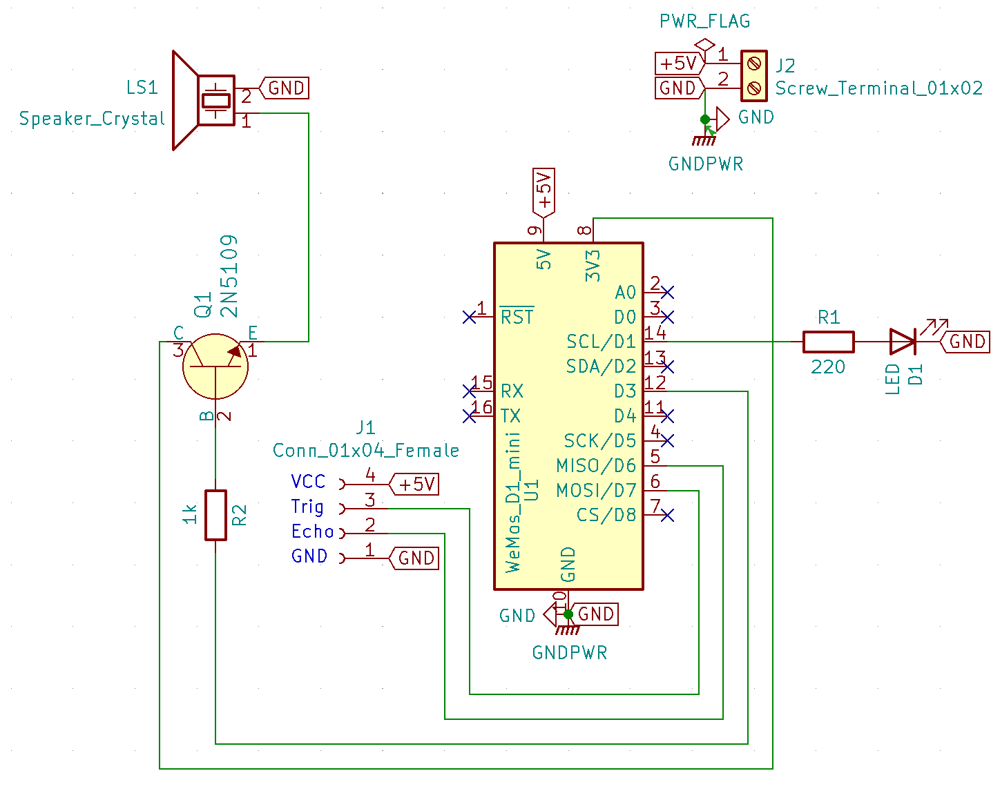
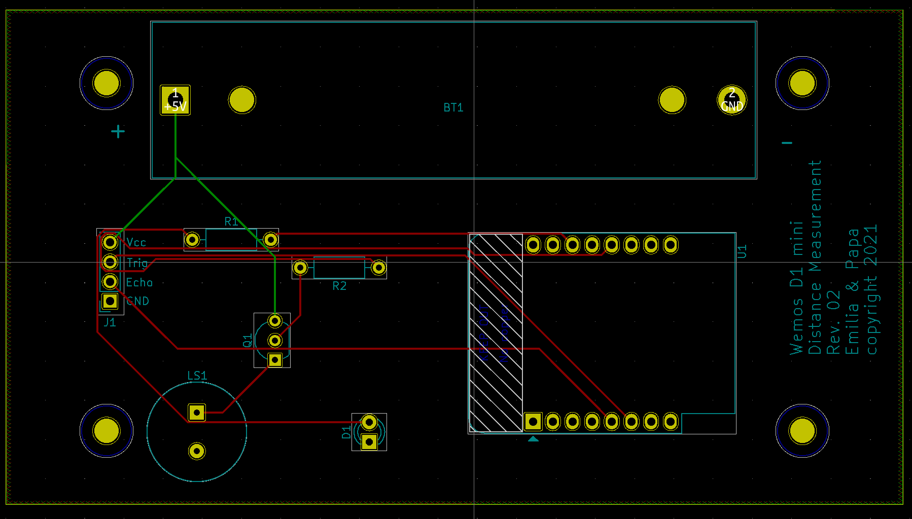
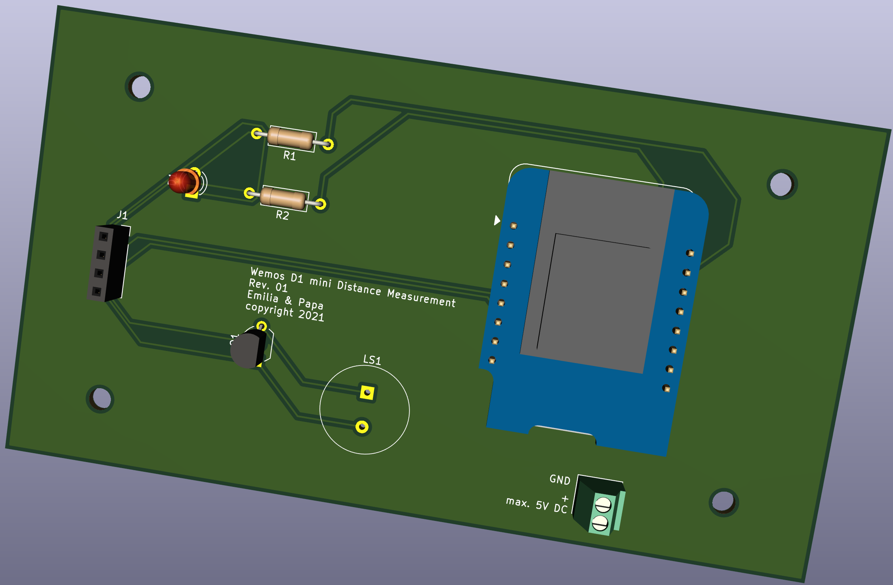

# ESP Distance Measurement — Full Documentation

A small handheld ultrasonic "distance radar" built on a WeMos D1 mini (ESP8266).
The closer an object is, the faster an LED blinks and a buzzer beeps. It started
as a weekend project to build together with my daughter.

- [1. Overview](#1-overview)
- [2. How it works](#2-how-it-works)
- [3. Hardware](#3-hardware)
  - [3.1 Bill of materials](#31-bill-of-materials)
  - [3.2 Pin mapping](#32-pin-mapping)
  - [3.3 Schematic, PCB and 3D view](#33-schematic-pcb-and-3d-view)
- [4. Firmware](#4-firmware)
  - [4.1 Sketches](#41-sketches)
  - [4.2 Distance → beep interval](#42-distance--beep-interval)
  - [4.3 Build & flash](#43-build--flash)
- [5. Tests](#5-tests)
- [6. Troubleshooting](#6-troubleshooting)
- [7. Changes & fixes](#7-changes--fixes)

---

## 1. Overview

| | |
|---|---|
| **Microcontroller** | WeMos D1 mini (ESP8266) |
| **Sensor** | HC-SR04 ultrasonic range finder |
| **Outputs** | LED + piezo buzzer (driven via an NPN transistor) |
| **Range** | ~2 cm … 5 m |
| **Power** | 5 V (battery `BT1` / USB) |
| **Firmware** | Arduino sketch, `Serial` at 115200 baud |

The behaviour: every loop the firmware fires one ultrasonic ping, converts the
echo time to a distance, and translates that distance into a blink/beep
interval. Far away → slow beep. Very close → solid tone. Nothing in range →
silent.

## 2. How it works

An HC-SR04 measures distance by emitting a 40 kHz ultrasonic burst and timing
how long the echo takes to return:

1. The MCU pulses `TRIG` HIGH for **10 µs**.
2. The sensor emits 8 ultrasonic cycles and raises `ECHO`.
3. `ECHO` stays HIGH for the round-trip travel time of the sound.
4. Distance = `(echo_time / 2) × speed_of_sound`.

With the speed of sound ≈ 343.2 m/s = **0.03432 cm/µs**:

```
distance_cm = (echo_time_µs / 2) × 0.03432
```

If no echo returns, `pulseIn()` times out and returns `0`. The firmware treats
that (and any reading outside ~2 cm…5 m) as **"no measurement"** and stays quiet,
rather than mistaking it for a zero-centimetre object.

## 3. Hardware

### 3.1 Bill of materials

| Ref | Part | Notes |
|-----|------|-------|
| `U1` | WeMos D1 mini (ESP8266) | Main controller |
| `J1` | 4-pin header | HC-SR04 connector: GND / Echo / Trig / 5V |
| `D1` | LED | Visual indicator |
| `R1` | Resistor | LED series resistor |
| `Q1` | NPN transistor | Buzzer driver |
| `R2` | Resistor | Transistor base resistor |
| `LS1` | Piezo buzzer (PS1240) | Audible indicator |
| `BT1` | Battery / 5 V supply | Power input |

*(Refs taken from the KiCad netlist `Hardware/KiCad_Files/Distance_Measurement_V2.net`.)*

### 3.2 Pin mapping

Verified against the KiCad netlist. **Use these in the firmware.**

| Function | WeMos label | ESP8266 GPIO | Driven via |
|----------|-------------|--------------|------------|
| Ultrasonic **Trigger** | D7 | **GPIO13** | direct to `J1` |
| Ultrasonic **Echo** | D6 | **GPIO12** | direct from `J1` |
| **LED** | D1 | **GPIO5** | `R1` |
| **Buzzer** | D3 | **GPIO0** | `R2` → `Q1` → `LS1` |

> **Note on GPIO0 (buzzer):** GPIO0 is a boot-strapping pin on the ESP8266. It
> must be HIGH at power-up to boot from flash. The transistor base sits behind
> `R2`, so the pin is free to float high at boot — but if you ever rewire the
> buzzer, keep this constraint in mind.

> **Note on the HC-SR04 connector `J1`:** the header order is
> `GND · Echo(GPIO12) · Trig(GPIO13) · 5V`. Make sure the sensor is plugged in
> with matching orientation (sensor pinout is `VCC · Trig · Echo · GND`).

### 3.3 Schematic, PCB and 3D view

| Schematic | PCB | 3D |
|---|---|---|
|  |  |  |

Source files:
- KiCad project: `Hardware/KiCad_Files/`
- Gerbers (V2): `Hardware/Gerber_Distance_Measurement_V2/`
- Circuit diagram PDFs: `Hardware/Circuit Diagram/`
- Interactive BOM: `Hardware/bom/ibom.html`
- Fritzing layout: `Hardware/Fritzing/`

## 4. Firmware

### 4.1 Sketches

| Sketch | Purpose |
|--------|---------|
| `Software/Test_LED_Simple/` | Blink the LED only (GPIO5). |
| `Software/Test_Buzzer_Simple/` | Beep the buzzer only (GPIO0). |
| `Software/Test_UltraSonic_Simple/` | Print measured distance over `Serial`. |
| `Software/Final_Software/` | The complete device (sensor + LED + buzzer). |

The final sketch keeps its pure logic in
[`distance_logic.h`](../Software/Final_Software/distance_logic.h) so it can be
unit-tested off-device (see [Tests](#5-tests)).

### 4.2 Distance → beep interval

`distanceToWaitingMs()` maps a distance to the LED/buzzer half-period:

| Distance (cm) | Half-period (ms) | Feel |
|--------------:|-----------------:|------|
| 400 … 500 | 1000 | very slow |
| 300 … 399 | 800 | |
| 200 … 299 | 700 | |
| 100 … 199 | 500 | |
| 80 … 99 | 400 | |
| 60 … 79 | 300 | |
| 40 … 59 | 200 | |
| 20 … 39 | 100 | |
| 10 … 19 | 50 | fast |
| 2 … 9 | 0 | **solid** tone/light |
| no echo / >5 m | — | **silent** |

### 4.3 Build & flash

1. Install the [Arduino IDE](https://www.arduino.cc/en/software).
2. Add ESP8266 board support: **File → Preferences → Additional Boards Manager
   URLs** → `https://arduino.esp8266.com/stable/package_esp8266com_index.json`,
   then install **esp8266** in the Boards Manager.
3. Select board **LOLIN(WEMOS) D1 R2 & mini**.
4. Open `Software/Final_Software/Final_Software.ino`.
5. Upload, then open the Serial Monitor at **115200 baud**.

## 5. Tests

The conversion and mapping logic is covered by host-side unit tests — no
hardware required:

```sh
cd Software/Tests
c++ -std=c++11 -Wall -Wextra test_distance_logic.cpp -o test_distance_logic
./test_distance_logic
```

See [`Software/Tests/README.md`](../Software/Tests/README.md) for what is
covered.

## 6. Troubleshooting

| Symptom | Likely cause |
|---------|--------------|
| Always "No reading" | Echo not on GPIO12 / sensor connector reversed / no 5 V to sensor. |
| Device beeps non-stop with nothing in front | Old firmware (pre-fix). Reflash the current `Final_Software`. |
| Board won't boot / hangs at power-up | Something holding GPIO0 LOW at boot (buzzer wiring). |
| Distances jump around | Soft/angled/small targets reflect poorly; aim at a flat surface. |
| Nothing on Serial | Wrong baud rate — set the monitor to 115200. |

## 7. Changes & fixes

A detailed log of the bug fixes and improvements made to the firmware is in
[`WORK_REPORT.md`](../WORK_REPORT.md).
